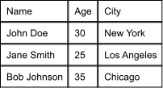
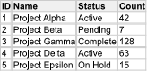
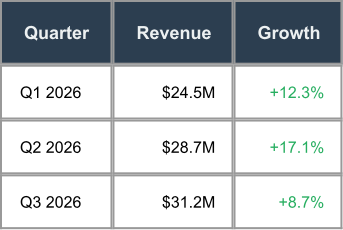
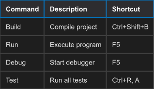
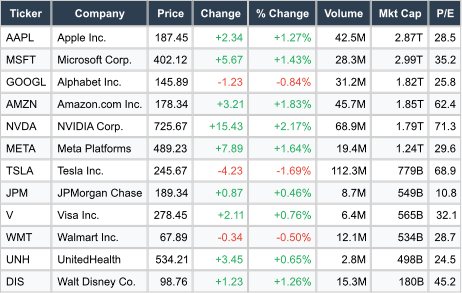
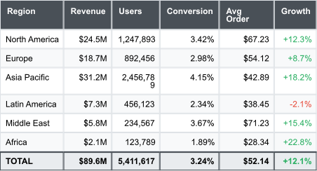

# BlazorFast.ImageSharp.TableGenerator

[](https://www.nuget.org/packages/BlazorFast.ImageSharp.TableGenerator/)
[](LICENSE)
[](https://dotnet.microsoft.com/)

A powerful table rendering library for **SixLabors.ImageSharp** that generates beautiful table images with an HTML/CSS-inspired fluent API.

## ✨ Features

- 🎨 **Rich Styling** — Full control over colors, borders, fonts, padding, and alignment
- 📊 **Advanced Layout** — Row/column spans, auto-sizing columns, text wrapping
- 🎯 **CSS-Like API** — Familiar fluent API with style cascading
- 📑 **Section Support** — Header, body, and footer sections
- 🦓 **Zebra Striping** — Built-in alternating row styles
- ⚡ **High Performance** — Font caching and optimized rendering
- 🚀 **Extension Methods** — Quick table generation from collections with built-in themes

## 📦 Installation

```bash
dotnet add package BlazorFast.ImageSharp.TableGenerator
```

## 🚀 Quick Start

### Builder API

```csharp
using BlazorFast.ImageSharp.TableGenerator;

using BlazorFast.ImageSharp.TableGenerator.Builders;

var table = TableBuilder.Create()
    .Body(body => body
        .Row("Name", "Age", "City")
        .Row("John Doe", "30", "New York")
        .Row("Jane Smith", "25", "Los Angeles"))
    .Build();

var image = table.Render();
image.SaveAsPng("table.png");
```



### Extension Method (Fastest)

```csharp
using BlazorFast.ImageSharp.TableGenerator.Extensions;

public record Person(string Name, int Age, string City);

var people = new[]
{
    new Person("Alice", 30, "New York"),
    new Person("Bob", 25, "San Francisco"),
    new Person("Charlie", 35, "Seattle")
};

// Generate table image directly from collection
var image = people.ToTableImage();
image.SaveAsPng("people.png");
```

## 📸 Style Showcase

### Condensed | Cozy | Roomy




### Minimalist | Dark Mode



## 💼 Real-World Examples

### Financial Data with Color-Coded Values


### Analytics Dashboard with Footer Totals


## 📚 Core Examples

### Styled Table with Header

```csharp
var table = TableBuilder.Create()
    .DefaultFont("Arial", 14)
    .CellPadding(12)
    .Border(2)
    .Style(s => s.Background("#f8f9fa").BorderColor("#dee2e6"))
    .Header(header => header
        .Style(s => s.Background("#007bff").TextColor("#ffffff").Bold())
        .Row("Product", "Price", "Stock"))
    .Body(body => body
        .Row("Laptop", "$999", "15")
        .Row("Mouse", "$25", "50"))
    .Build();
```


### Alternating Rows

```csharp
var table = TableBuilder.Create()
    .Body(body => body
        .Row("001", "Alice", "Engineering", "$75,000")
        .Row("002", "Bob", "Marketing", "$65,000"))
    .AlternateRows(
        even => even.Background("#ffffff"),
        odd => odd.Background("#f8f9fa"))
    .Build();
```


### Column Spans

```csharp
var table = TableBuilder.Create()
    .Body(body => body
        .Row(row => row
            .Cell("Q1 Report", cell => cell.ColSpan(3).Style(s => s.Bold())))
        .Row("Month", "Revenue", "Growth"))
    .Build();
```


## 🚀 Extension Methods API

The extension methods provide the fastest way to generate tables from any collection of objects.

### Basic Usage

```csharp
using SixLabors.ImageSharp.TableGenerator.Extensions;

var data = new[] { /* your objects */ };
var image = data.ToTableImage();
```

### Built-in Themes

```csharp
// Light theme (default)
var lightTable = data.ToTableImage();

// Dark theme
var darkTable = data.ToTableImage(new TableGeneratorOptions 
{ 
    Theme = ThemeMode.Dark 
});

// Minimal theme (no background colors)
var minimalTable = data.ToTableImage(new TableGeneratorOptions 
{ 
    Theme = ThemeMode.Minimal 
});

// Compact theme (reduced padding)
var compactTable = data.ToTableImage(new TableGeneratorOptions 
{ 
    Theme = ThemeMode.Compact 
});
```

### Advanced Options

```csharp
var options = new TableGeneratorOptions
{
    // Theme selection
    Theme = ThemeMode.Dark,
    
    // Filter properties to include
    PropertyFilter = prop => prop.Name != "InternalId",
    
    // Customize column ordering
    PropertyOrder = new[] { "Name", "Age", "Email" },
    
    // Format property names (headers)
    PropertyNameFormatter = prop => prop.Name.ToUpper(),
    
    // Format cell values
    ValueFormatter = val => val?.ToString() ?? "N/A",
    
    // Hide headers
    IncludeHeaders = false
};

var image = data.ToTableImage(options);
```

### Real-World Extension Examples

#### Example 1: Filter Sensitive Properties

```csharp
public record Employee(string Name, string Email, string Password, decimal Salary);

var employees = GetEmployees();

// Exclude sensitive fields
var image = employees.ToTableImage(new TableGeneratorOptions
{
    PropertyFilter = prop => prop.Name != "Password" && prop.Name != "Salary"
});
```

#### Example 2: Custom Column Order and Formatting

```csharp
var options = new TableGeneratorOptions
{
    Theme = ThemeMode.Dark,
    PropertyOrder = new[] { "Country", "City", "Population" },
    PropertyNameFormatter = prop => prop.Name.ToUpper(),
    ValueFormatter = val => val is int num ? num.ToString("N0") : val?.ToString()
};

var cities = GetCities();
var image = cities.ToTableImage(options);
```

#### Example 3: Data Export Without Headers

```csharp
// Generate compact data table without headers
var image = transactions.ToTableImage(new TableGeneratorOptions
{
    Theme = ThemeMode.Compact,
    IncludeHeaders = false
});
```

## 🎯 API Reference

### TableBuilder Methods

| Method | Description |
|--------|-------------|
| `Create()` | Start building a table |
| `DefaultFont(family, size)` | Set default font |
| `CellPadding(padding)` | Set cell padding |
| `Border(width)` | Set border width |
| `Width(maxWidth)` | Set maximum width |
| `Header(configure)` | Configure header section |
| `Body(configure)` | Configure body section |
| `Footer(configure)` | Configure footer section |
| `AlternateRows(even, odd)` | Apply zebra striping |
| `Style(configure)` | Apply table-level styles |
| `Build()` | Create the table model |

### StyleBuilder Methods

| Method | Description |
|--------|-------------|
| `Background(color)` | Set background color |
| `TextColor(color)` | Set text color |
| `BorderColor(color)` | Set border color |
| `Border(width)` | Set all borders |
| `BorderTop/Right/Bottom/Left(width)` | Set individual borders |
| `FontFamily(name)` | Set font family |
| `FontSize(size)` | Set font size |
| `Bold()` | Make text bold |
| `Italic()` | Make text italic |
| `HAlign(alignment)` | Set horizontal alignment |
| `VAlign(alignment)` | Set vertical alignment |
| `Padding(padding)` | Set cell padding |

### CellBuilder Methods

| Method | Description |
|--------|-------------|
| `ColSpan(count)` | Span multiple columns |
| `RowSpan(count)` | Span multiple rows |
| `Align(hAlign, vAlign)` | Set cell alignment |
| `Style(configure)` | Apply cell-level styles |

### Extension Methods

| Method | Description |
|--------|-------------|
| `ToTableImage<T>(this IEnumerable<T>)` | Generate table from collection with default options |
| `ToTableImage<T>(this IEnumerable<T>, TableGeneratorOptions)` | Generate table with custom options |

### TableGeneratorOptions Properties

| Property | Type | Description |
|----------|------|-------------|
| `Theme` | `ThemeMode` | Light, Dark, Minimal, or Compact |
| `PropertyFilter` | `Func<PropertyInfo, bool>` | Filter which properties to include |
| `PropertyOrder` | `string[]` | Specify column order |
| `PropertyNameFormatter` | `Func<PropertyInfo, string>` | Format column headers |
| `ValueFormatter` | `Func<object?, string>` | Format cell values |
| `IncludeHeaders` | `bool` | Show/hide header row |

## 🏗️ Architecture

The library follows a clean layered architecture:

1. **Builder API** — Fluent interface for constructing tables
2. **Extension API** — Reflection-based table generation from collections
3. **Model Layer** — Immutable records representing table structure
4. **Layout Engine** — Grid positioning, span resolution, and text wrapping
5. **Rendering Engine** — ImageSharp.Drawing integration with style cascading

## ⚡ Performance

- **Font Caching** — Fonts are cached by family, size, and style to avoid repeated I/O
- **Lazy Measurement** — Text is measured only when necessary during layout
- **Optimized Text Wrapping** — Greedy algorithm with character-level fallback
- **Modern C# Patterns** — Uses spans, records, and value types for efficiency
- **Zero Allocation Paths** — Critical paths avoid unnecessary allocations

## 📄 License

This project is licensed under the **Apache License 2.0** - see the [LICENSE](LICENSE) file for details.

### Third-Party Licenses

This library depends on the following third-party packages, each with their own licenses:

- **[SixLabors.ImageSharp](https://github.com/SixLabors/ImageSharp)** - Licensed under the [Six Labors Split License](https://github.com/SixLabors/ImageSharp/blob/main/LICENSE)
  - **Free for non-commercial use** and small/medium commercial use
  - Commercial license required for large commercial applications
  - See their licensing page for details: https://sixlabors.com/pricing/

- **[SixLabors.ImageSharp.Drawing](https://github.com/SixLabors/ImageSharp.Drawing)** - Licensed under the [Six Labors Split License](https://github.com/SixLabors/ImageSharp.Drawing/blob/main/LICENSE)
  - Same licensing terms as ImageSharp above

- **[SixLabors.Fonts](https://github.com/SixLabors/Fonts)** - Licensed under the [Apache License 2.0](https://github.com/SixLabors/Fonts/blob/main/LICENSE)

**Important:** While `BlazorFast.ImageSharp.TableGenerator` itself is Apache 2.0 licensed, your use of this library requires compliance with the SixLabors ImageSharp licensing terms. Please review the [SixLabors licensing page](https://sixlabors.com/pricing/) to determine if you need a commercial license for your use case.

## 🤝 Contributing

Contributions are welcome! 

1. Fork the repository
2. Create a feature branch
3. Make your changes with tests
4. Submit a pull request

Please ensure all tests pass and code follows existing patterns.

## 🙏 Credits

Built on:
- [SixLabors.ImageSharp](https://github.com/SixLabors/ImageSharp) — Core image processing
- [SixLabors.ImageSharp.Drawing](https://github.com/SixLabors/ImageSharp.Drawing) — Drawing primitives
- [SixLabors.Fonts](https://github.com/SixLabors/Fonts) — Font loading and text measurement

---

**Made with ❤️ for .NET**
